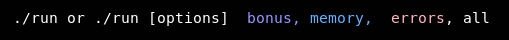
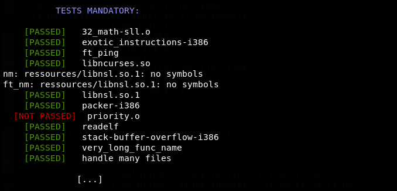
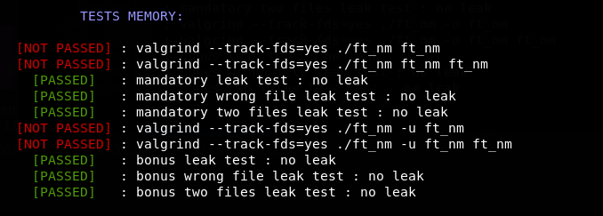

## nm_tester

Put the tester inside your project folder and ./run.

[The test binaries come from here](https://github.com/leowz)

You can decomment some lines in the *./srcs/test_mandatory.sh* and *./srcs/test_bonus.sh* scripts to see the diff function output.

You can modify *srcs/test_bonus.txt* adding or removing the flags/options you've done.

You can also add more test files in the ressources/ folder, it'll automatically add them in the tests.
